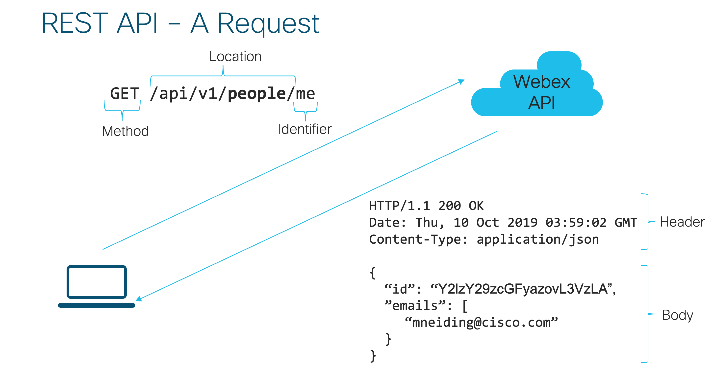

# What is REST?

REST, short for **RE**presentational **S**tate **T**ransfer, is a architecture style for defining web services. 

Build on top of the HTTP standard it allows us to access, create and modify resources on a remote system without the need to understand the underlying data storage infrastructure like the database.

## How does HTTP work?

In order to understand REST we need to first understand the protocol that REST is build upon. HTTP, short for, **H**yper**T**ext **T**ransfer **P**rotocol is the protocol behind most of what we know today as the *world wide web*. Initiated in 1989 HTTP allows a user to send a *request* for a resource and receive a *response* back. When you access http://www.cisco.com/index.html your browser is sending a request to the Cisco webserver. This webserver then gathers your information, in this case the html, images, styling and every other component of the website and returns them in one (or more) *responses*. 

This simple *request*-*response* model allows for all the interactions we know when browsing the web.

### A look into a HTTP Request

A HTTP request always follows a well-defined format that is plain text. 

```
Request Line = Method Request-URI HTTP-Version

Request Header(s)

(Optional) Body
```

Let's have a look at each of these components.

The *Request Line* is made of the following components:

* **Method** like `GET`, `DELETE`, `POST` or `PUT`. The method defines what kind of action we want to carry out with the resource. In the example of requesting www.cisco.com we would want to retrieve the information so `GET` would be used. We will have a deep look into the different methods once we talk about REST.
* **Request-URI** this *Uniform Resource Identifier* specifies what resource we want to request from the server. In our sample request we are requesting the file `index.html` from www.cisco.com so the URI would be `http://wwww.cisco.com/index.html`
* **HTTP-Version** the version of the HTTP protocol to use. This will pretty much always be `HTTP/1.1`

The *Request Line* thus specifies the resource we want (the main page under `index.html` in our example) as well as what we want to do with this resource (`GET` means we are retrieving the information).

The request line is followed by zero to n *Request Headers*. These can be used to send additional information to the web server. While your request can contain whatever headers you want some common headers include

* **Accept-Charset** to define what kind of character encoding you want back
* **Accept** to define what kind of data format you would want back. This becomes important for REST APIs later on. 
* **User-Agent** to tell the webserver what kind of browser you are using

Last is the, also optional, body. `GET` requests typically come without a body but `POST` requests that are used to send information to a server would contain that data inside of the request body. When you fill out a form on a web page and click the submit button the information you put into that form will be send to the server inside the request body of a `POST` request.

So what would a full request look like? Here is an example for a request without a body:

```
GET http://wwww.cisco.com/index.html HTTP/1.1
User-Agent: Mozilla/5.0 (X11; Linux i686; rv:81.0) Gecko/20100101
Accept-Charset: utf-8
```

And here is one for a request with a body:

```
POST http://www.cisc.com/login HTTP/1.1
User-Agent: Mozilla/5.0 (X11; Linux i686; rv:81.0) Gecko/20100101
Accept-Charset: utf-8
Content-Type: application/x-www-form-urlencoded
Content-Length: 120

username=admin&password=totallynotapassword
```

After receiving such a request the webserver will gather all relevant information and send back a *HTTP response*. 

### A look into a HTTP Response

Similar to a HTTP Request, a HTTP Response is a well-defined plain text that looks like this: 

```
Status Line = HTTP-Version Status-Code Reason-Phrase

Response Header(s)

Message Body
```

The status line, similar to the *request line* gives us status information for the response. It contains:

* **The HTTP Version** that this server supports. Most likely this will be `HTTP/1.1`. 
* **The Status Code** a three-digit integer that defines the status of our response. We will have a deeper look into status codes below. 
* **Reason-Phrase** A textual companion of the status code
* **Response Headers** containing additional information.Most web servers send headers like the date, the server version or when this document was last modified as well as the *Content-Type*, for example `text/html` for web pages and the *Content-Length*, back. 
* **Message Body** then contains the content itself. In the example of our web request this will be the html needed to display the webpage. 

A full *HTTP response* thus could look like this:

```
HTTP/1.1 200 OK
Date: Mon, 05 Oct 2020 10:00:31 GMT
Content-Length: 230
Content-Type: text/html; charset=utf-8

<html>
<body>
<h1>Hello World!</h1>
</body>
</html>
```

### HTTP Status Codes

A extremely useful part of HTTP are the *status codes* of a HTTP response. These 3-digit numbers allow a server to convey the status of a response to the client without having to define custom error formats. 

Status codes come in five different *classes*. Each class is identified by the leading number:

* **1xx** status codes are purely informational. They signal the client that a request has been received and is being processed. You will rarely see these in the wild. 
* **2xx** status codes mean that the request has been understood correctly and that the action has been carried out successfully
* **3xx** status codes are redirects. This means that the client needs to, for example, request a different URI in order to complete the request.
* **4xx** status codes signal a error by the user. This can be anything from  a wrongly formatted request to requesting a document that is no longer available (the 404 error that you might have encountered when browsing the web)
* **5xx** status codes signal a server error. These errors occure when, despite a valid request, the server could not fulfill the request and send a response.

But why did we talk about HTTP again? Because REST is build upon it! 

## Back to REST

When dealing with a REST API we are using *HTTP requests* to access, modify or create resources on a server. The server then returns a *HTTP response* that contains the resource we have accessed, modified or created with our *HTTP request*.

In REST, we use the URI of our HTTP request to specify which resource we would like to access. As an example let's look at a request to the Webex Teams API that retrieves all the user information for the user. 

Since we want to retrieve information we are going to use `GET`. 

Next, we need to define the *resource* we would like to access. The Webex Teams API has a resource called *people*, available in version 1 of the api, so our URI becomes: `/api/v1/people`.

Next we need to identify the person we want the data of. What kind of identifier is used here is specified by the API. In the case of the Webex Teams API we could either use a `personId` or the keyword `me` which we are going to do in this example.

Our final request line thus looks like this: `GET /api/v1/people/me`.

The Webex API server then does a bunch of operations to retrieve all these informations from its backend system. The beauty of the REST API architecture style really is that we don't **need to know** what the API server is doing in the background. All we need to know is the resources available, how they are identified, and what kind of information we can carry out on them. 

After all computing is done the Webex API will return us the requested resource via a *HTTP response* that could look like this: 

```
HTTP/1.1 200 OK
Date: Mon, 05 Oct 2020 10:00:31 GMT
Content-Type: application/json

{
   "id": "Y2lzY29zcGFyazovL3VzLA”,
   "emails": [
      "mneiding@cisco.com",
   ],
   "firstName": "Marcel",
   "lastName": "Neidinger",
   [...] # More lines omitted for brevity
}
```


### HTTP Methods and their associated operations

In a REST API, each operation that can be carried out on a resource is represented by a HTTP Method. A well-designed REST API should use

* `GET` to retrieve a resource or a list of resources
* `POST` to create a new resource
* `DELETE` to delete a resource 
* `PATCH` to modify a resource
* `PUT` to completely replace a resource

Sending (i.e. *creating*) a new message on the Webex Teams API would be done using a `POST` request while you could delete a message with a `DELETE` request. 

### Resources in REST

The last puzzle piece we need is to understand how REST represents resources. While you can use many different data formats the most common these days is *JSON*. In the example above you saw that the information about our user are returned as a json-formatted string. 

In the same way we can also use json to *modify* or *create* new resources. To create a new resource we would send a `POST` request that, in the request body, contains the resource we would want to create. Following the example mentioned above, here is what a HTTP request for creating a message with the Webex Teams API would look like:

```
POST /api/v1/messages 
Content-Type: application/json

{
   "toPersonEmail": "mneiding@cisco.com",
   "text": "Hi, this is a message from the API"
}
```

What we would get back is a HTTP response with status code `201 Created`. 

With the theory taken care of, lets have a look at how we can explore REST APIs using a graphical interface called *Postman*. 

> :rocket: If you want to know more about the theory behind REST APIs you can have a look at the [REST API Theoretical Deep Dive](../extras/rest_theory/Readme.md) session.
 
<div align="right">
   
   [Prev](what_is_an_api.md) - [Next](postman.md)
</div>